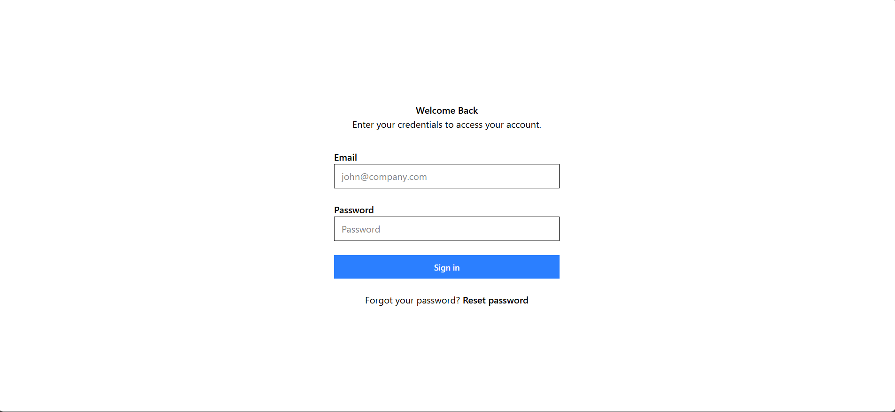

# React Basic Form Documentation



## Project Overview

This project is a simple React application that showcases a clean, minimal login form built with React 19 and Vite. It demonstrates modern React patterns including hooks usage and form handling with simulated network requests.

## Technologies Used

- **React**: v19.0.0
- **React DOM**: v19.0.0
- **Vite**: v6.2.0 for fast development and building
- **Tailwind CSS**: v4.0.15 for styling
- **ESLint**: v9.21.0 for code quality

## Core Functionality

The application renders a login form with the following features:

- Email and password input fields with validation
- Form submission handling with simulated network request
- Loading state management using React's `useTransition` hook
- Form reset after submission
- Responsive design using Tailwind CSS

## Component Structure

### App Component (`src/App.jsx`)

The main component that renders the login form interface and handles all functionality.

#### State Management

```jsx
const [pending, startTransition] = useTransition();
```

- **pending**: Tracks whether a form submission is in progress
- **startTransition**: Used to mark non-urgent updates to prevent UI freezing

##### Why useTransition?

The `useTransition` hook is a key React 19 feature utilized in this project for several important reasons:

1. **Improved User Experience**: By using `useTransition`, we prevent the UI from freezing during the simulated network request, keeping the interface responsive.

2. **Visual Feedback**: The `pending` state allows us to provide immediate visual feedback to users (via the disabled button) while the form submission is being processed.

3. **Prioritizing Updates**: React's Concurrent Mode through `useTransition` allows the browser to remain responsive during expensive operations by:

   - Letting urgent updates (like typing or clicking) take precedence
   - Breaking time-consuming updates into smaller chunks
   - Yielding to the browser when needed to ensure smooth interactions

4. **Handling Asynchronous Operations**: In this form, we use it to manage a simulated 2-second network request without blocking the main thread.

Without `useTransition`, the form submission might cause noticeable UI freezing, especially on slower devices or with more complex operations.

#### Key Functions

##### `handleForm`

```jsx
const handleForm = (e) => {
  e.preventDefault();
  console.log(e.target.email.value);
  console.log(e.target.password.value);

  if (e.target.email.value === "" || e.target.password.value === "") {
    alert("Please fill in all the fields");
    return;
  }

  startTransition(async () => {
    await new Promise((res) => {
      setTimeout(res, 2000); // Simulate a slow network request
    });
  });

  //clear the values
  e.target.email.value = "";
  e.target.password.value = "";
};
```

This function:

1. Prevents the default form submission behavior
2. Logs the email and password values
3. Validates that both fields have values
4. Simulates a network request with a 2-second delay using `useTransition`
5. Clears the form fields after submission

## UI Components

### Login Form

The form includes:

- Email input with validation and autocomplete
- Password input with validation and autocomplete
- Submit button that disables during submission
- "Reset password" link

## Styling

The project uses Tailwind CSS for styling with custom classes for:

- Layout structure (flex, padding, margins)
- Form elements (inputs, buttons)
- Typography (text size, weight, color)
- Responsive design

## Project Setup

### Development

To run the project in development mode:

```bash
npm run dev
```

This starts the Vite development server with hot module replacement.

### Building

To build the project for production:

```bash
npm run build
```

### Linting

To run ESLint checks:

```bash
npm run lint
```

## Future Improvements

Potential enhancements for this project:

1. Add form validation with error messages
2. Implement actual authentication with a backend
3. Add "Remember me" functionality
4. Create a registration form
5. Add unit tests for components
6. Implement dark mode using Tailwind
7. Add success/error notifications after submission

## Conclusion

This minimal React form project demonstrates fundamental concepts of modern React development including:

- React hooks (useTransition)
- Form handling
- Tailwind CSS styling
- Component architecture
- Modern build tooling with Vite

It serves as a solid foundation for more complex authentication systems and form implementations.
